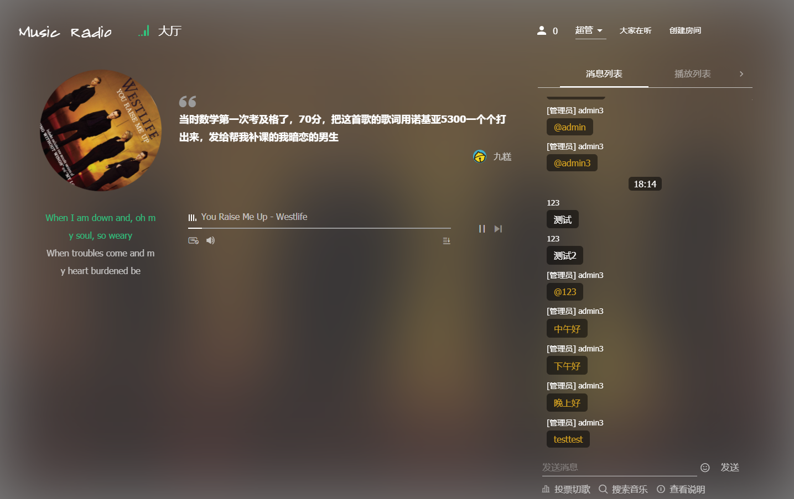

## MsicRadio - 音乐点播平台

Inspired by [SyncMusic](https://github.com/kasuganosoras/SyncMusic)

 




## 简介

MusicRadio是一个使用nodejs开发的基于websocket的在线同步播放音乐室，支持多房间(公开/非公开房间) / 多管理员 / 点歌 / 随机播放 /聊天/ 弹幕等功能特性，并提供了基本的管理功能，如：屏蔽用户、屏蔽ip地址、禁言、设置房间管理员等。

---

## 功能

1. :house: 房间
    - 大厅
    - 创建房间
        - 私密（密码加入）
        - 公开
        - 人数限制
        - 设置房间管理员
        - 屏蔽ip/用户
        - 禁言
2. :musical_note: 音乐播放器（同一房间操作同步）
    - 暂停/播放
    - 切歌
    - 调整进度
    - 屏蔽音乐（默认自动静音）
3. :speech_balloon: 聊天
    - 颜色标识（管理员高亮）
    - 表情包支持
    - @支持
    - 特殊消息悬浮提醒
    - 未读消息提醒
    - 弹幕
    - 消息撤回
4. :eyes: 搜索、点歌
    - 模糊搜索
    - 批量点歌
5.  :notes: 播放列表
    - 增删（管理员）
    - 移动 （管理员）
6.  :chart_with_upwards_trend: 全站数据聚合展示
7.  :star: 超级管理员角色切换(可切换为游客)
8.  :heavy_check_mark:  其他......

## 部署安装

### docker-compose 部署 （推荐）

**注意: 在要部署的服务器上要安装有docker以及docker-compose**

#### 安装

##### 拉取docker-compose文件

`
    wget https://raw.githubusercontent.com/sanmmm/MusicRadio/master/docker-compose.yml
`

##### 启动

`
    docker-compose up -d 
`

其他配置项可见[配置项说明](#配置项说明)

### docker部署 

**注意: 在要部署的服务器上要安装有docker**

#### 安装

##### 拉取docker镜像

```
docker pull sanmmmm/music_radio
```

##### 安装配置依赖服务

关于依赖服务, 见 [依赖服务](#依赖服务)

##### 运行

在[上述](#安装配置依赖服务)配置好之后，运行

```
docker run  -d -p 3001:3001 -e REDIS_URL=redis://examplehost:6379 -e NETEASE_API_URL=http://examplehost:3000 sanmmmm/music_radio

```
其他配置项见[配置项说明](#配置项说明)

### 自行部署

#### 部署依赖服务

详情见[依赖服务](#依赖服务)

#### 拉取代码

```
    git clone git@github.com:sanmmm/MusicRadio.git
```

#### 打包

配置前后端的打包所需环境变量， 见[配置项说明-环境变量](#配置项说明-环境变量)

前端打包:

```
    cd frontend && npm run build
```

后端打包:

```
    cd backend && npm run build
```

#### 运行

在设置好[依赖服务](#依赖服务)的环境变量之后，运行

``` 
    node <YOUT_BACKEND_BUILD_TO_DIRECTORY>/app.js
```

### 依赖服务

MusicRadio依赖的其他三方服务有：`redis`（用来存储数据）以及 [网易云音乐api](https://github.com/Binaryify/NeteaseCloudMusicApi/)。所以在运行`MusicRadio`之前需要先配置启动上述两项服务。然后通过[后端配置文件](#配置文件说明)或者
`环境变量`来配置到`MusicRadio`之中供其与之通信

#### 配置到环境变量

举例: 假设redis的地址为 localhost:6379, 则设置环境变量`REDIS_URL`的值为`redis:localhost:6379`。 而网易云音乐apiServer 的地址为 localhost:3000, 则设置环境变量`NETEASE_API_URL`的值为`http://localhost:3000`

**注：通过docker部署时则需要在运行docker命令的时候通过 `-e` 参数来把环境变量注入，可见[docker运行](#docker部署)**

环境变量具体说明， 见[配置项说明-环境变量](#配置项说明-环境变量)

### 配置项说明

#### 环境变量

##### **docker-compose运行所需环境变量**

**MUSIC_RADIO_TAG**: 

必须项: `否`

默认: `latest`

说明: docker 镜像的tag版本，缺省条件下为latest

**CONFIG_DIR**

说明: 见[CONFIG_DIR](#config-dir)

##### **前端打包所需环境变量**

**OUTPUT_PATH**: 

必须项: `否`

默认: `./static`

说明: webpack打包输出目录


**NODE_ENV**: 

必须项: `是`

说明: 生产环境设置为production

**ASYNC_SETTINGS**: 
<span id="sync-settings"></span>

必须项: `否`

说明: 设置前端配置文件的加载方式，不设置时（默认）为打包时打包配置文件（配置文件为`frontend/config/settings.ts`）,
设置为`1`时则为打包时不讲配置文件打包进去，网页运行时再从后端加载配置文件,
该配置文件可见 [后端客户端配置文件](#backend-client-settings-file)

##### **后端运行所需环境变量**

**NODE_ENV**: 

必须项: `是`

说明: 生产环境设置为production

**STATIC_PATH**: 

必须项: `否`

默认: `./static`

说明: 后端静态文件夹所在目录，默认为后端根目录

**CONFIG_DIR**: 
<span id="config-dir"></span>

必须项: `否`

默认: [后端自定义配置存放文件夹](#custom-backend-settings-dir)

说明: 添加配置文件目录,见[后端自定义配置存放文件夹](#custom-backend-settings-dir)

**SESSION_TYPE**: 

必须项: `否`

默认: `cookie`

说明: 后端会话管理方式，默认为`cookie`，还可以配置为`ip`, `token`

**REDIS_URL**: 

必须项: `否`

说明: 后端会话管理方式，默认值配置在[后端默认配置文件中](#backend-settings-default-file)。通过环境变量配置的值优先级最高，将会覆盖在配置文件中配置的值

**NETEASE_API_URL**: 

必须项: `否`

说明: 后端会话管理方式，默认值配置在[后端默认配置文件中](#backend-settings-default-file)。通过环境变量配置的值优先级最高，将会覆盖在配置文件中配置的值


#### 配置文件说明

**前后端共用配置文件夹:** `/common/`

**前端配置文件夹:** `/frontend/config/`

**后端默认配置文件夹:** `/backend/default/`
<span id="backend-default-settings-dir"></span>

该文件夹下存放的为系统默认配置，**请不要编辑**该文件夹下内容，
可以通过在配置[后端自定义配置存放文件夹](#custom-backend-settings-dir)中写入同名配置文件来覆盖default文件夹下的配置文件。如：假设default文件夹下有默认配置文件: `FILE_NAME.default.js`, 可以通过在[后端自定义配置存放文件夹](#custom-backend-settings-dir)中配置 FILE_NAME.js来覆盖上述默认配置。

该文件夹下的配置文件有:

`/backend/default/bitSymbols.default.json`

`/backend/default/blockMusic.default.json`: 屏蔽的音乐列表

`/backend/default/blockWords.default.json`: 聊天敏感词列表

`/backend/default/emojiData.default.json`: 表情包列表配置文件

`/backend/default/clientSettings.js`: 
<span id="backend-client-settings-file">前端配置文件（前端从后端加载配置文件时返回的配置文件）具体可见[ASYNC_SETTINGS环境变量](#sync-settings)</span>

`/backend/default/settings.default.js`: 后端配置文件
<span id="backend-settings-default-file"></span>


**后端自定义配置存放文件夹：** `/backend/config/`
<span id="custom-backend-settings-dir"></span>

也可以通过[环境变量](#config-dir)添加`自定义配置文件夹`的位置

该文件夹存放用户的自定义配置文件（可以覆盖同名默认配置文件的配置）


### 超级管理员

超级管理员的注册页面为 `yourhost/admin/register`

注册时需要一个`注册码` 可以在[配置文件](#custom-backend-settings-dir)的`superAdminRegisterTokens`字段配置该码，该字段数据类型为字符串数组

超级管理员的登录页面为 `yourhost/admin/login`


